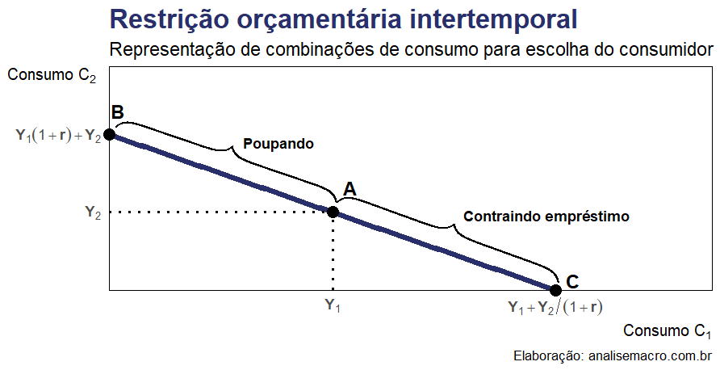

```{r, file = "./rmd/setup.R", include=FALSE}
```

```{r setup, include=FALSE}
options(htmltools.dir.version = FALSE)
options(htmltools.preserve.raw = FALSE)
knitr::opts_chunk$set(
  echo = FALSE,
  warning   = FALSE,  # exibir avisos do console?
  message   = FALSE,  # exibir mensagens do console?
  dpi       = 300,    # resolução
  fig.align = "center"# alinhamento de imagens
  )
```


```{css, echo=FALSE}
pre {
  white-space: pre-wrap;
  overflow-y: scroll !important;
  max-height: 45vh !important;
  overflow-x: auto;
  max-width: 100%;
}
.tiny55 .remark-code {
  font-size: 55%; !important;
}
```


### Temas de hoje

- Consumo conforme Keynes<br><br>
- Escolha intertemporal de Fisher<br><br>
- Extensões<br><br>
  - Teoria do ciclo de vida de Modigliani<br><br>
  - Hipótese de renda permanente de Friedman<br><br>
  - Hipótese de passeio aleatório de Hall<br><br>
  - Gratificação instantânea de Laibson


---
### Introdução

```{r, echo=FALSE}
library(magrittr)

dados <- sidrar::get_sidra(api = "/t/2072/n1/all/v/933,939,940/p/all") %>% 
  dplyr::mutate(
    date     = lubridate::yq(`Trimestre (Código)`),
    variable = dplyr::recode(
      `Variável`,
      "Produto Interno Bruto" = "PIB",
      "(=) Poupança bruta" = "Poupança",
      "(-) Despesa de consumo final" = "Consumo"
      ) %>% 
      factor(levels = c("PIB", "Consumo", "Poupança")),
    value    = `Valor` / 1e6, # converte de milhões p/ trilhões de R$
    .keep    = "none"
    ) %>% 
  dplyr::as_tibble()

ppib <- dados %>%
  tidyr::pivot_wider(
    id_cols = "date", 
    names_from = "variable", 
    values_from = "value"
    ) %>% 
  dplyr::mutate(ppib = `Consumo` / `PIB`) %>% 
  dplyr::summarise(ppib_mean = mean(ppib)) %>% 
  dplyr::pull(ppib_mean)
```


.pull-left[

Nesta aula iremos abordar uma intersecção entre a micro e a macro no que se trata da teoria do consumo das famílias, explicada por 2 visões de economistas proeminentes.

- **Motivação**: de que forma as famílias decidem sobre o quanto de sua renda devem consumir  hoje e quanto devem poupar para o futuro?

Essa é uma questão microeconômica, mas que possui implicações macroeconômicas. No modelo de Solow vimos que a taxa de poupança é determinante para o estado estacionário, ou seja, é crucial para analisar o longo prazo. O consumo representa cerca de `r round(ppib, 2) * 100`% do PIB, portanto flutuações dessa variável também são importantes em períodos de recessão e expansão.

]

.pull-right[

```{r, echo=FALSE, fig.asp=0.8}
dados %>% 
  ggplot2::ggplot() +
  ggplot2::aes(x = date, y = value, fill = variable) +
  ggplot2::geom_area(position = ggplot2::position_dodge()) +
  ggplot2::scale_fill_manual(values = c("#282f6b", "#b22200", "#224f20")) +
  ggplot2::scale_y_continuous(
    labels = scales::label_number(Big.mark = ".", decimal.mark = ",")
    ) +
  ggplot2::labs(
    title    = "Comportamento agregado das famílias",
    subtitle = "Contas Econômicas Trimestrais, valores em R$ trilhões",
    y        = "R$",
    x        = NULL,
    fill     = NULL,
    caption  = "**Dados**: CNT/IBGE | **Elaboração**: analisemacro.com.br"
    ) +
  ggplot2::theme_light() +
  ggplot2::theme(
    plot.title      = ggplot2::element_text(size = 20, face = "bold", color = "#282f6b"),
    plot.subtitle   = ggplot2::element_text(size = 14),
    plot.caption    = ggtext::element_markdown(size = 10),
    axis.title      = ggplot2::element_text(size = 12, face = "bold"),
    axis.text       = ggplot2::element_text(size = 12, face = "bold"),
    legend.text     = ggplot2::element_text(size = 12, face = "bold"),
    legend.position = "bottom"
    )
```

]

Tomaremos como referência Mankiw (2010) ao longo desta aula, em especial o capítulo 17 que detalha extensões dos modelos (não abordaremos aqui).


---
### Consumo conforme Keynes

Keynes (1936) fez da função de consumo um elemento central de sua teoria de flutuações econômicas. O autor parte de 3 premissas básicas:

1. A **propensão marginal a consumir (PMgC)<sup>1</sup>** se situa entre 0 e 1 &rarr; quando você ganha R$ 1 adicional, você gasta uma parte e guarda o restante;
2. A **propensão média a consumir (PMC)<sup>2</sup>** diminui conforme a renda aumenta &rarr; poupar é um luxo, ricos poupam mais de sua renda do que pobres;
3. A **renda é o determinante principal do consumo** &rarr; as taxas de juros não têm um papel importante.

&rarr; Com base nessas premissas, a **função consumo keynesiana** é expressa por:

.pull-left[

$$C = \overline{C} + cY$$

]

.pull-right[

onde:
- $C$ &rarr; é o consumo;
- $\overline{C}$ &rarr; é uma constante maior do que zero;
- $c$ &rarr; é a PMgC, valor entre 0 e 1;
- $Y$ &rarr; é a renda disponível.

]


.footnote[

<sup>1</sup> PMgC é a quantidade consumida a cada unidade de moeda adicional de renda.<br>
<sup>2</sup> PMC é a proporção entre o consumo e a renda.

]


---
### Consumo conforme Keynes

Gráficamente:

.pull-left[

A função consumo keynesiana satisfaz as 3 premissas de Keynes pois:

1. $c$ ou PMgC está entre 0 e 1 (é a inclinação da reta);
2. A PMC é expressa como $PMC = \frac{C}{Y} = \frac{\overline{C}}{Y} + c$, portanto conforme $Y$ aumenta $\frac{\overline{C}}{Y}$ diminui e a PMC ou $\frac{C}{Y}$ também;
3. O consumo é determinado pela renda disponível (juros não está incluído).

]

.pull-right[

```{r, echo=FALSE, fig.asp=0.6}
renda <- 0:100
constante <- 40
pmgc <- 0.8
consumo <- constante + pmgc * renda

ggplot2::ggplot() +
  ggplot2::aes(x = renda, y = consumo) +
  ggplot2::geom_line(size = 2, color = "#282f6b") +
  ggplot2::annotate(
    geom     = "text",
    x        = max(renda) - quantile(renda)[2],
    y        = max(consumo) - 32,
    label    = latex2exp::TeX("$C = \\bar{C} + cY$", bold = TRUE),
    color    = "#282f6b",
    size     = 5,
    fontface = "bold"
    ) +
  ggplot2::annotate(
    geom     = "segment",
    x        = 0, 
    xend     = mean(renda),
    y        = 0,
    yend     = mean(consumo),
    linetype = "dotted",
    size     = 1
    ) +
  ggplot2::annotate(
    geom     = "segment",
    x        = 5, 
    xend     = 12,
    y        = 8,
    yend     = 8,
    size     = 0.7
    ) +
  ggplot2::annotate(
    geom     = "segment",
    x        = 12, 
    xend     = 12,
    y        = 8,
    yend     = 19,
    size     = 0.7
    ) +
  ggplot2::annotate(
    geom     = "text",
    x        = 8.5, 
    y        = 4,
    label    = "1",
    size     = 4,
    fontface = "bold"
    ) +
  ggplot2::annotate(
    geom     = "text",
    x        = 26, 
    y        = 14,
    label    = latex2exp::TeX("$PMC = \\frac{C}{Y} = \\frac{\\bar{C}}{Y} + c$", bold = TRUE),
    size     = 4,
    fontface = "bold"
    ) +
  ggplot2::annotate(
    geom     = "segment",
    x        = 6, 
    xend     = 12,
    y        = 43.3,
    yend     = 43.3,
    size     = 0.7
    ) +
  ggplot2::annotate(
    geom     = "segment",
    x        = 12, 
    xend     = 12,
    y        = 43.3,
    yend     = 49,
    size     = 0.7
    ) +
  ggplot2::annotate(
    geom     = "text",
    x        = 9, 
    y        = 39,
    label    = "1",
    size     = 4,
    fontface = "bold"
    ) +
  ggplot2::annotate(
    geom     = "text",
    x        = 18, 
    y        = 46,
    label    = "PMgC",
    size     = 4,
    fontface = "bold"
    ) +
  ggplot2::scale_y_continuous(
    breaks = constante,
    labels = latex2exp::TeX("$\\bar{C}$", bold = TRUE),
    limits = c(0, NA),
    expand = ggplot2::expansion(0)
    ) +
  ggplot2::scale_x_continuous(expand = ggplot2::expansion(0)) +
  ggplot2::labs(
    title   = "Função consumo keynesiana",
    y       = "Consumo (C)",
    x       = "Renda (Y)",
    caption = "**Elaboração**: analisemacro.com.br"
    ) +
  ggplot2::theme_light() +
  ggplot2::theme(
    plot.title = ggplot2::element_text(size = 20, face = "bold", color = "#282f6b"),
    plot.caption = ggtext::element_markdown(size = 10),
    axis.title = ggplot2::element_text(size = 12, face = "bold"),
    axis.ticks.length = ggplot2::unit(0, "cm"),
    axis.text         = ggplot2::element_blank(),
    axis.title.y      = ggplot2::element_text(angle = 0),
    axis.title.x      = ggplot2::element_text(hjust = 1),
    panel.grid        = ggplot2::element_blank()
  )
```

]

Dados e estudos com séries temporais curtas da época confirmaram as premissas de Keynes, mas não por muito tempo. Após a Segunda Guerra a premissa da PMC não se sustentou (o trabalho do economista Simon Kuznets indicou que a PMC é constante no longo prazo). Em outras palavras, haveria duas funções de consumo: uma de curto e outra de longo prazo. No anos 1950 os trabalhos de Modigliani e Friedman, com base nas contribuições de Fisher, exploraram esses resultados contraditórios, sendo ambos agraciados pelo prêmio Nobel de economia.


---
### Escolha intertemporal de Fisher

A função consumo de Keynes relaciona o consumo corrente com a renda disponível corrente, mas essa relação é incompleta. **Quando pessoas decidem quanto consumir e quanto poupar, elas consideram tanto o presente quanto o futuro**. Em outras palabras, há um *trade-off* entre consumir mais hoje e menos amanhã. Dessa forma, o economista Irving Fisher desenvolveu um modelo que possibilita analisar como consumidores racionais e preocupados com o futuro (*forward-loking*) realizam escolhas intertemporais — ou seja, escolhas que envolvem diferentes períodos no tempo.

**Restrição orçamentária intertemporal**

Restrição orçamentária é um limite do quanto as pessoas podem consumir, restringidas pela sua renda. Quando as pessoas estão decidindo entre quanto consumir hoje e quanto poupar para o futuro, essa restrição se torna intertemporal. Vamos começar a entender o modelo de Fisher analisando essa restrição.

&rarr; Hipóteses simplificadoras:

- O consumidor vive em dois períodos: juventude e velhice;
- O consumidor possui a renda $Y_1$ e o consumo $C_1$ na juventude e, respectivamente, $Y_2$ e $C_2$ na velhice;
- As variáveis são em valores reais, ajustadas pela inflação;
- O consumo pode ser maior ou menor do que a renda em qualquer período, dada a possibilidade de o consumidor contrair empréstimos e poupar;
- Taxas de juros da poupança e de contrair empréstimos é a mesma.


---
### Escolha intertemporal de Fisher

&rarr; **Como a renda desse consumidor limita o seu consumo nesses dois períodos?**

No primeiro período (juventude), a poupança é igual a renda menos o consumo:

$$S = Y_1 - C_1$$
onde $S$ é a poupança. No segundo período (velhice), o consumo é igual a poupança acumulada, incluindo o juros recebidos sobre essa poupança, mais a renda do segundo período, ou seja:

$$C_2 = (1 + r)S + Y_2$$
onde $r$ é a taxa de juros real. 

Por exemplo, se a taxa de juros real é de 5%, então a cada 1 unidade de moeda (&dollar;) poupada na juventude, o consumidor terá &dollar;1,05 adicionais na velhice. Como não há um terceiro período, o consumidor não poupa nada no segundo período.

A variável $S$ pode representar tanto poupança quanto empréstimo: se o consumo na juventude é menor que a renda na juventude, então $S$ é a poupança, caso contrário o consumidor está contraindo empréstimo e $S$ é o empréstimo.


---
### Escolha intertemporal de Fisher

Para derivar a restrição orçamentária intertemporal inserimos a penúltima equação na última, substituindo $S$:

$$C_2 = (1 + r)(Y_1 - C_1) + Y_2$$

E simplificamos a equação trazendo todos os termos de consumo para o lado esquerdo:

$$\begin{align}
(1 + r)C_1 + C_2 & = (1 + r)Y_1 + Y_2, \ \ \text{dividindo por } (1 + r) \text{ obtemos:}\\
C_1 + \frac{C_2}{(1 + r)} & = Y_1 + \frac{Y_2}{(1 + r)}
\end{align}$$

&rarr; Essa equação relaciona o consumo e a renda nos dois períodos, representando a **restrição orçamentária intertemporal**. Como interpretá-la?

- Se a taxa de juros é zero, o consumo total é igual a renda total dos dois períodos;
- Se a taxa de juros é positiva, o consumo e a renda futuros são **descontados** pelo fator de $(1 + r)$.

Isso implica que a renda futura vale menos do que a renda presente, e que o consumo futuro custa menos do que o consumo presente pelo fator de $1/(1 + r)$, que é a quantidade de consumo na juventude que o consumidor deve abrir mão para obter 1 unidade de consumo na velhice.


---
### Escolha intertemporal de Fisher

Gráficamente:

.pull-left[

- **Ponto A**: consumidor gasta toda sua renda em consumo em cada período $(C_1 = Y_1$ e $C_2 = Y_2)$;
- **Ponto B**: consumidor poupa toda sua renda, não consome nada na juventude $(C_1 = 0)$, portanto o consumo na velhice é $C_2 = (1 + r)Y_1 + Y_2$;
- **Ponto C**: consumidor gasta além de sua renda em consumo no primeiro período, toma empréstimo para compensar a diferença e não consome nada na velhice $(C_2 = 0)$, portanto o consumo na juventude é $C_1 = Y_1 + Y_2/(1 + r)$.

]

.pull-right[

```{r, echo=FALSE}

```

```{r, echo=FALSE, eval=FALSE}
library(pBrackets)

c1 <- 0:100
c2 <- 100:0

ggplot2::ggplot() +
  ggplot2::aes(x = c1, y = c2) +
  ggplot2::geom_line(size = 2, color = "#282f6b") +
  ggplot2::annotate(
    geom     = "segment",
    x        = mean(c1),
    xend     = mean(c1),
    y        = 0,
    yend     = mean(c2),
    linetype = "dotted",
    size     = 1
    ) +
  ggplot2::annotate(
    geom     = "segment",
    x        = 0,
    xend     = mean(c1),
    y        = mean(c2),
    yend     = mean(c2),
    linetype = "dotted",
    size     = 1
    ) +
  ggplot2::annotate(
    geom  = "point",
    y     = mean(c2),
    x     = mean(c1),
    size  = 4,
    color = "black"
    ) +
  ggplot2::annotate(
    geom     = "text",
    y        = mean(c2) + 16,
    x        = mean(c1) + 4,
    size     = 5,
    color    = "black",
    label    = "A",
    fontface = "bold"
    ) +
  ggplot2::annotate(
    geom  = "point",
    y     = 0,
    x     = max(c1),
    size  = 4,
    color = "black"
    ) +
  ggplot2::annotate(
    geom     = "text",
    y        = 6,
    x        = max(c1) + 4,
    size     = 5,
    color    = "black",
    label    = "C",
    fontface = "bold"
    ) +
  ggplot2::annotate(
    geom  = "point",
    y     = max(c2),
    x     = 0,
    size  = 4,
    color = "black"
    ) +
  ggplot2::annotate(
    geom     = "text",
    y        = max(c2) + 15,
    x        = 2,
    size     = 5,
    color    = "black",
    label    = "B",
    fontface = "bold"
    ) +
  ggplot2::annotate(
    geom     = "text",
    y        = max(c2) - 5,
    x        = mean(c1) - 12,
    size     = 3.7,
    color    = "black",
    label    = "Poupando",
    fontface = "bold"
    ) +
  ggplot2::annotate(
    geom     = "text",
    y        = mean(c2) - 2,
    x        = max(c1) - 2,
    size     = 3.7,
    color    = "black",
    label    = "Contraindo empréstimo",
    fontface = "bold"
    ) +
  ggplot2::scale_x_continuous(
    breaks = c(mean(c2), max(c2)),
    labels = c(
      latex2exp::TeX("$Y_1$", bold = TRUE),
      latex2exp::TeX("$Y_1 + Y_2 / (1 + r)$", bold = TRUE)
      ),
    expand = ggplot2::expansion(c(0, 0.3))
    ) +
  ggplot2::scale_y_continuous(
    breaks = c(mean(c1), max(c1)),
    labels = c(
      latex2exp::TeX("$Y_2$", bold = TRUE),
      latex2exp::TeX("$Y_1 (1 + r) + Y_2$", bold = TRUE)
      ),
    expand = ggplot2::expansion(c(0, 0.25))
    ) +
  ggplot2::coord_cartesian(clip = "off") +
  ggplot2::labs(
    title    = "Restrição orçamentária intertemporal",
    subtitle = "Representação de combinações de consumo para escolha do consumidor",
    y        = latex2exp::TeX("Consumo $C_2$"),
    x        = latex2exp::TeX("Consumo $C_1$"),
    caption  = "Elaboração: analisemacro.com.br"
    ) +
  ggplot2::theme_light() +
  ggplot2::theme(
    plot.title        = ggplot2::element_text(size = 20, face = "bold", color = "#282f6b"),
    plot.subtitle     = ggplot2::element_text(size = 14),
    plot.caption      = ggplot2::element_text(size = 10),
    axis.title        = ggplot2::element_text(size = 12, face = "bold"),
    axis.title.y      = ggplot2::element_text(angle = 0, margin = ggplot2::margin(r = -60)),
    axis.title.x      = ggplot2::element_text(hjust = 1),
    axis.ticks.length = ggplot2::unit(0, "cm"),
    axis.text         = ggplot2::element_text(size = 11),
    axis.text.x       = ggplot2::element_text(margin = ggplot2::margin(t = 6)),
    axis.text.y       = ggplot2::element_text(margin = ggplot2::margin(r = 6)),
    panel.grid        = ggplot2::element_blank(),
    panel.border      = ggplot2::element_rect(color = "black")
  )

#grid::grid.locator(unit = "native")
grid.brackets(
  x1 = 418, 
  x2 = 692, 
  y1 = 250, 
  y2 = 349, 
  lwd = 2, 
  col = "black"
  )

grid.brackets(
  x1 = 144, 
  x2 = 417, 
  y1 = 157, 
  y2 = 250, 
  lwd = 2, 
  col = "black"
  )
```

]

Do ponto A ao B, o consumidor escolhe uma combinação onde consome menos que sua renda na juventude, portanto está poupando o restante para a velhice. Do ponto A ao C, o consumidor escolhe uma combinação onde consome mais que sua renda na juventude, portanto está tomando empréstimo para compensar a diferença.


---
### Escolha intertemporal de Fisher

.pull-left[

**Preferências do consumidor**

A escolha de consumo que o consumidor faz entre os dois períodos é representada pelo que se chama de **curvas de indiferença**, que mostram combinações de consumo no primeiro e segundo período que igualmente satisfazem o consumidor (por isso *indiferença*).

O gráfico ao lado exibe duas curvas de indiferença do consumidor:

]

.pull-right[

```{r, echo=FALSE, fig.width=7}
library(jpeg)
xmax <- 9
ymax <- 9

curvas <- Hmisc::bezier(
  x = c(0.9, xmax - 6, xmax), 
  y = c(ymax, ymax - 6, 0.9)
  ) %>% 
  as.data.frame()

curvas %>% 
  ggplot2::ggplot() +
  ggplot2::aes(x = x, y = y) + 
  ggplot2::annotate(
    geom = "segment",
    x    = curvas$x[31],
    y    = curvas$y[31],
    xend = curvas$x[31],
    yend = curvas$y[41],
    size = 1
    ) +
  ggplot2::annotate(
    geom = "segment",
    x    = curvas$x[41],
    y    = curvas$y[41],
    xend = curvas$x[31],
    yend = curvas$y[41],
    size = 1
    ) +
  ggplot2::geom_line(size = 2, color = "#282f6b") +
  ggplot2::geom_line(
    mapping = ggplot2::aes(x = x + 1, y = y + 1), 
    size    = 2, 
    color   = "#282f6b"
    ) +
  ggplot2::annotate(
    geom  = "text", 
    x     = c(max(curvas$x), max(curvas$x + 1)) + 0.4, 
    y     = c(min(curvas$y), min(curvas$y + 1)),
    label = c(latex2exp::TeX("$CI_1$", bold = TRUE), latex2exp::TeX("$CI_2$", bold = TRUE)),
    size  = 5
    ) +
  ggplot2::annotate(
    geom = "point",
    x    = c(quantile(curvas$x)[2:4], quantile(curvas$x)[3] + 1),
    y    = c(quantile(curvas$y)[4:2], quantile(curvas$x)[3] + 1),
    size = 4
    ) +
  ggplot2::annotate(
    geom     = "text",
    x        = c(quantile(curvas$x)[2:4], quantile(curvas$x)[3] + 1) + .3,
    y        = c(quantile(curvas$y)[4:2], quantile(curvas$x)[3] + 1) + .3,
    label    = c("Y", "X", "W", "Z"),
    size     = 4,
    fontface = "bold"
    ) +
  ggplot2::annotate(
    geom     = "text",
    x        = curvas$x[22],
    y        = curvas$y[42],
    label    = "TMgS",
    size     = 4,
    fontface = "bold"
    ) +
  ggplot2::labs(
    title    = "Curvas de indiferença do consumidor",
    y        = latex2exp::TeX("Consumo $C_2$", bold = TRUE),
    x        = latex2exp::TeX("Consumo $C_1$", bold = TRUE),
    caption  = "**Elaboração**: analisemacro.com.br"
    ) +
  ggplot2::theme_light() +
  ggplot2::theme(
    plot.title        = ggplot2::element_text(size = 20, face = "bold", color = "#282f6b"),
    plot.caption      = ggtext::element_markdown(size = 10),
    axis.title        = ggplot2::element_text(size = 12, face = "bold"),
    axis.title.y      = ggplot2::element_text(angle = 0),
    axis.title.x      = ggplot2::element_text(hjust = 1),
    axis.ticks.length = ggplot2::unit(0, "cm"),
    axis.text         = ggplot2::element_blank(),
    panel.grid        = ggplot2::element_blank()
    )
```

]

- O consumidor é indiferente entre as combinações Y, X e W;<br>
- A inclinação da curva é chamada de **taxa marginal de substituição** (TMgS), que mostra o quanto de $C_2$ o consumidor exige para compensar uma diminuição de 1 unidade de $C1$, ou seja, é a taxa pela qual o consumidor aceita substituir consumo na juventude por consumo na velhice;<br>
- Curvas de indiferença maiores $(CI_2)$ são, por hipótese, preferíveis, ou seja, o consumidor prefere Z em relação aos pontos Y, X e W.


---
### Escolha intertemporal de Fisher

**Otimização**: se juntarmos a restrição orçamentária intertemporal com as curvas de indiferença do consumidor podemos entender como o consumidor decide sobre quanto consumir em cada período.

.pull-left[

&rarr; O consumidor deseja terminar com a melhor combinação de consumo nos dois períodos (maior curva de indiferença possível);<br>
&rarr; Entretanto, o consumidor é limitado pela restrição orçamentária intertemporal, de modo que a combinação de consumo deve estar sobre a reta da restrição ou abaixo dela;<br>
&rarr; O ponto onde a curva e a linha se tocam é o ponto ótimo que traz a melhor combinação de consumo nos dois períodos e que cabe no orçamento do consumidor.

]

.pull-right[

```{r, echo=FALSE, fig.width=7}
curvas %>% 
  ggplot2::ggplot() +
  ggplot2::aes(x = x, y = y) + 
  ggplot2::annotate(
    geom  = "segment",
    x     = 0,
    xend  = max(curvas$x) + 2.8,
    y     = max(curvas$y) + 2.8,
    yend  = 0,
    size  = 2,
    color = "#b22200"
    ) +
  ggrepel::geom_label_repel(
    mapping      = ggplot2::aes(x = x, y = y), 
    data         = data.frame(x = 0.5, y = max(curvas$y) + 2.2), 
    label        = "Restrição\nOrçamentária",
    size         = 4,
    color        = "#b22200",
    fontface     = "bold", 
    nudge_x      = 1.8,
    nudge_y      = 2.2, 
    segment.size = 0.8, 
    label.size   = 0.8
    ) +
  ggplot2::geom_line(size = 2, color = "#282f6b") +
  ggplot2::geom_line(
    mapping = ggplot2::aes(x = x + 1, y = y + 1), 
    size    = 2, 
    color   = "#282f6b"
    ) +
  ggplot2::geom_line(
    mapping = ggplot2::aes(x = x + 2, y = y + 2), 
    size    = 2, 
    color   = "#b22200"
    ) +
  ggplot2::annotate(
    geom = "point",
    x    = c(quantile(curvas$x)[3] + 1.97),
    y    = c(quantile(curvas$y)[3] + 1.97),
    size = 5
    ) +
  ggplot2::annotate(
    geom     = "segment",
    x        = 0,
    y        = c(quantile(curvas$y)[3] + 1.97),
    xend     = c(quantile(curvas$x)[3] + 1.97),
    yend     = c(quantile(curvas$y)[3] + 1.97),
    linetype = "dotted",
    size     = 1
    ) +
  ggplot2::annotate(
    geom     = "segment",
    x        = c(quantile(curvas$x)[3] + 1.97),
    y        = 0,
    xend     = c(quantile(curvas$x)[3] + 1.97),
    yend     = c(quantile(curvas$y)[3] + 1.97),
    linetype = "dotted",
    size     = 1
    ) +
  ggplot2::geom_line(
    mapping = ggplot2::aes(x = x + 3, y = y + 3), 
    size    = 2, 
    color   = "#282f6b"
    ) +
  ggplot2::annotate(
    geom  = "text", 
    x     = c(max(curvas$x) + 0:3) + 0.4, 
    y     = c(min(curvas$y) + 0:3),
    label = c(
      latex2exp::TeX("$CI_1$", bold = TRUE), 
      latex2exp::TeX("$CI_2$", bold = TRUE),
      latex2exp::TeX("$CI_3$", bold = TRUE),
      latex2exp::TeX("$CI_4$", bold = TRUE)
      ),
    size  = 5
    ) +
  ggplot2::scale_x_continuous(
    expand = ggplot2::expansion(c(0, 0.1))
    ) +
  ggplot2::scale_y_continuous(
    expand = ggplot2::expansion(c(0, 0.25))
    ) +
  ggplot2::labs(
    title    = "Ponto ótimo do consumidor",
    y        = latex2exp::TeX("Consumo $C_2$", bold = TRUE),
    x        = latex2exp::TeX("Consumo $C_1$", bold = TRUE),
    caption  = "**Elaboração**: analisemacro.com.br"
    ) +
  ggplot2::theme_light() +
  ggplot2::theme(
    plot.title        = ggplot2::element_text(size = 20, face = "bold", color = "#282f6b"),
    plot.caption      = ggtext::element_markdown(size = 10),
    axis.title        = ggplot2::element_text(size = 12, face = "bold"),
    axis.title.y      = ggplot2::element_text(angle = 0),
    axis.title.x      = ggplot2::element_text(hjust = 1),
    axis.ticks.length = ggplot2::unit(0, "cm"),
    axis.text         = ggplot2::element_blank(),
    panel.grid        = ggplot2::element_blank()
    )
```

]

Observe que esse **ponto ótimo é a tangência entre as curvas**, ou seja, quando as inclinações são iguais. Portanto, corresponde a quando a TMgS é igual ao fator $1 + r$:

$$\text{Ponto ótimo do consumidor } \rightarrow \ TMgS = 1 + r$$


---
### Resumo e Extensões

- **Keynes** definiu a função consumo tendo como principal determinante a renda disponível, partindo das premissas de que a propensão marginal a consumir se situa entre 0 e 1 e de que a propensão média a consumir diminui conforme a renda aumenta;
- **Fisher** definiu a função consumo tendo como principal determinante os recursos ao longo da vida do consumidor, dado que o mesmo pode poupar e tomar empréstimos, encara um trade-off intertemporal e escolhe entre consumo presente e futuro para alcançar o maior nível de satisfação.

Extensões sobre essas teorias (e um roteiro de estudos) são descritas abaixo:

&rarr; **Teoria do ciclo de vida de Modigliani**: enfatiza que a renda varia de forma previsível durante a vida de um consumidor e que o mesmo utiliza a poupança e empréstimos para "suavizar" o seu consumo durante a vida. A função consumo, então, depende tanto da renda quando da riqueza;<br>
&rarr; **Hipótese de renda permanente de Friedman**: enfatiza que as pessoas passam por oscilações permanentes e transitórias na renda. A função consumo, então, depende principalmente da renda permanente e não muito da renda transitória, pois as pessoas podem poupar e tomar empréstimos e desejam suavizar seu consumo;<br>
&rarr; **Hipótese de passeio aleatório de Hall**: combina a hipótese de Friedman c/ a premissa de que os consumidores possuem expectativas racionais sobre sua renda futura, implicando que mudanças na renda são imprevisíveis;<br>
&rarr; **Gratificação instantânea de Laibson**: sugere que efeitos psicológicos são importantes p/ entender o comportamento do consumidor, pois as pessoas possuem forte desejo por gratificação imediata, o que as leva a serem inconsistentes ao longo do tempo e pouparem menos do que gostariam.


---
### Referências

Keynes, J. M. (1936). *The General Theory of Employment, Interest and Money*. Palgrave Macmillan. 

Mankiw, N. G. (2010). *Macroeconomics*. Worth Publishers. 
